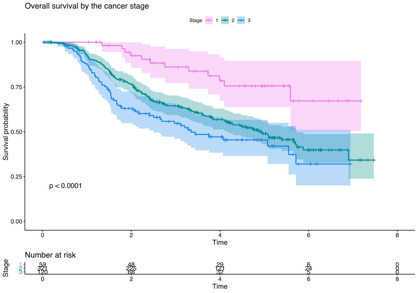
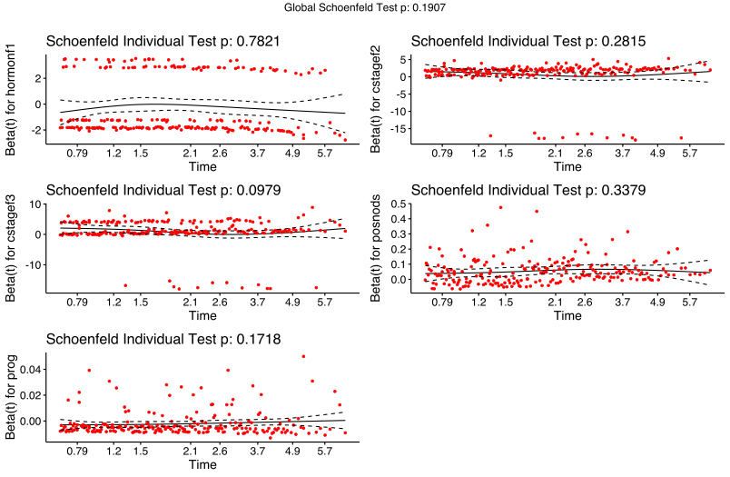
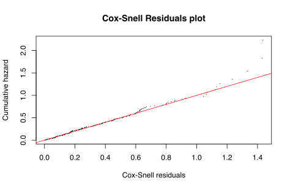
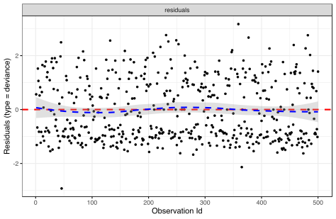
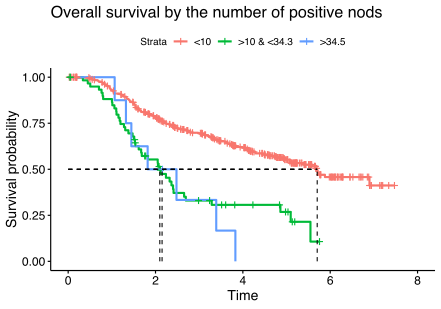
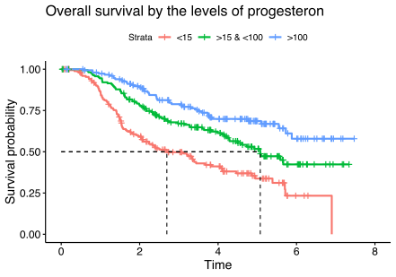

# Survival analysis in breast cancer data

The analysis is based on **breast cancer** data. This study gives the potential to extract significant information about the survival probability depending on several covariates (i.g., treatment, cancer stage, tumor size etc) and consequently to determine which factors influence more the progress of this disease.

# Installation & run project
These are the packages used in the analysis:
```R
library(survminer)
library(survival)
library(car)
library(glmnet)
library(cmprsk)
```

```bash
git clone https://github.com/askandali/breast-cancer-survival-analysis.git
cd breast-cancer-survival-analysis

install.packages("survminer","survival","car","glmnet","cmprsk")
Rscript tumor.R
```
## Data

The file **SurvData6.txt** consists of 500 observations and 10 variables. These variables give us the following information about a patient:

-  Her levels of progesteron and oestrogen
-  The tumor size and cancer stage
- Her age and if she is in menopause or not
- The treatment: hormone or placebo
- Time and censor 

## Methods

In the analysis, except from the descriptives evaluated to have a first look at the data, the methods used was :

- Several **Kamplan-Maier plots** were created so as to discover the cause-effect relation between survival and a specific characteristic. For example, in order to see how the stage of the cancer impact on the survival:
```
##Kaplan Mayer with Stage
# Plot the K-M by stage
KMstage<- survfit(s ~ cstage,data=bio)

ggsurvplot(KMstage, conf.int=TRUE, pval=TRUE, risk.table=TRUE, 
           legend.labs=c("1", "2","3"), legend.title="Stage",  
           palette=c("orchid2","darkcyan","dodgerblue2"), 
           title="Overall survival by the cancer stage", 
           risk.table.height=.15)
```


>The **Kaplan-Meier curve** shows what the probability of survival at a certain time interval.

- A Cox model with all covariates was implemented to further discover the influence of the variables. With Step and Lasso methods, the model performed good with only the following variables as statistically significant:
```
> summary(step_model)
Call:
coxph(formula = s ~ hormonf + cstagef + posnods + prog, data = bio1)

  n= 500, number of events= 219 

               coef  exp(coef)   se(coef)      z Pr(>|z|)    
hormonf1 -0.2427988  0.7844294  0.1464228 -1.658   0.0973 .  
cstagef2  0.7443520  2.1050770  0.3041344  2.447   0.0144 *  
cstagef3  0.9779653  2.6590404  0.3234166  3.024   0.0025 ** 
posnods   0.0532250  1.0546670  0.0081143  6.559  5.4e-11 ***
prog     -0.0020587  0.9979434  0.0006309 -3.263   0.0011 **
```

## Cox Model and Diagnostics 
Several diagnostics were implemented to see the performance of the model and if the proportional hazard assuption wasn't respected. The diagnostics were:

- **Schoenfeld residuals** (Testing proportional Hazards assumption)
```  
> test.ph <- cox.zph(step_model)
> test.ph
             rho  chisq      p
hormonf1 -0.0183 0.0765 0.7821
cstagef2 -0.0734 1.1599 0.2815
cstagef3 -0.1131 2.7387 0.0979
posnods   0.0913 0.9185 0.3379
prog      0.0863 1.8673 0.1718
GLOBAL        NA 7.4274 0.1907
```
>From the output above, the test is not statistically significant for each of the covariates, and the global test is also not statistically significant. Therefore, we can assume the proportional hazards.
```
test.ph <- cox.zph(step_model)
test.ph
ggcoxzph(test.ph)
```


>From the graphical inspection, there is no pattern with time. The assumption of proportional hazards appears to be supported for the covariates.

  - **Cox-Snell residuals**
```  
rc<-abs(censor-step_model$residuals)
km.rc<-survfit(Surv(rc, censor)~1)
summary.km.rc<-summary(km.rc)
rcu<-summary.km.rc$time
surv.rc<-summary.km.rc$surv
plot(rcu, -log(surv.rc),type="p", pch=".", xlab="Cox-Snell residuals", ylab="Cumulative hazard", lwd=2, main="Cox-Snell Residuals plot")
abline(a=0, b=1, col=2, ld=3)
  
```
> **Cox snell residuals plot**: If the Cox model provides a good fit of the data a straight line is expected



- **Deviance residuals**
```  
ggcoxdiagnostics(step_model, type = "deviance",
                 linear.predictions = FALSE, ggtheme = theme_bw())
```
> **Deviance residuals**: Positive values mean that the patient died sooner than expected, while negative values mean that the patient lived longer than expected.





## Results

 1. The most important findings from **Kaplan-Meier curves** were that the biggest influence of survival probability (cancer metastasis) were the **cancer stage** as depicted in the plot before, the **number of positive nods** and **progesteron & oestrogen**. Have a look at some of the curves:





>The folder plots contains all the Kaplan-Meier curves.

 2. The most important findings from **Cox Model** interpretation of coefficients were that when a womans does hormonotherapy and:
   -  the size of the tumor increases by 1mm, the hazard for metastasis increases 2%.
   -  she is at 2nd stage of cancer, she has x1.8 times more danger for metastasis from stage 1.
   - she is at 3nd stage of cancer, she has x4 times more danger for metastasis from stage 1.
   - and levels of progesteron increases by 1mm, the hazard for metastasis reduces 1%.
 
